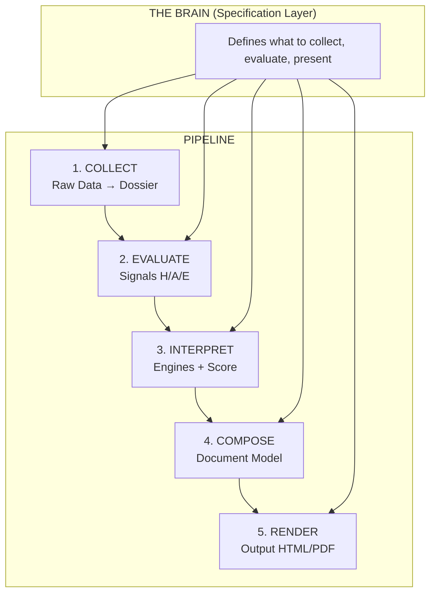

# Sasha Underwriting Platform: Master Strategy & Architecture Plan

## 1. Executive Summary: The Brain-Centric Architecture

The core insight for the Sasha Platform is that the **pipeline is secondary; the "Brain" is the primary product.** The system treats the accumulated knowledge about what makes a company risky for D&O liability as the core asset, decoupling the static definitions of risk from the code that executes it. 

The Brain stores rich, multi-dimensional knowledge across domains (Financial forensics, Litigation, Governance, Market/Stock, Business, etc.). The new architecture carries forward 400+ signal definitions and their rich annotations without loss, making them completely declarative.

---

## 2. The Complete Pipeline (5 Layers)

The system operates across 5 distinct layers, with the Brain acting alongside as the specification layer that tells each pipeline layer what to do.



### Layer 1: Data Collection (Company Dossier)
Pluggable collectors (`SECCollector`, `MarketCollector`, `LitigationCollector`, `WebCollector`) fetch data from their specific sources, normalize it, and return structured output into a unified `CompanyDossier` JSON file. Collectors act purely as dumb pipes—no analysis, just structuring.

### Layer 2: Signal Evaluation
Signals are evaluated **declaratively** by matching their `data_strategy.field_key` (defined in the Brain's YAML) to paths in the Company Dossier. This completely replaces thousands of lines of complex Python mappers.

### Layer 3: Interpretation (Engines & Scoring)
The system scores the company based on Signal results → Composite score → Tier. It maps signal results to 10 factors, detects multi-signal patterns, applies Critical Red Flag (CRF) gates, and outputs a tier (WIN to NO TOUCH).

### Layer 4 & 5: Composition and Rendering
The renderer receives the complete assessment and produces documents (HTML, PDF, etc.) using clean, template-driven sections.

---

## 3. The Brain & Decision Support Framework (H/A/E)

The system calculates "Claim Risk" using a multiplicative model:
**Claim Risk = Host (Base Rate) × Agent (Trigger) × Environment (Amplifier)**

### HOST (H) — "How sick are they?" (Inherent Susceptibility)
Measures the vulnerability based on structure and historical profile. Forms the **Base Rate** (0–1).
*   **H1: Constitutional** (Entity type, listing age, M&A activity)
*   **H2: Financial** (Altman Z-Score, current ratio, debt/equity)
*   **H3: Governance** (Board independence, CEO/Chair duality, ISS rating)
*   **H4: Management** (CEO/CFO tenure, insider selling sentiment)
*   **H5: Operational** (Global footprint, regulatory burden, supply chain)
*   **H6: Technological** (Cybersecurity posture, R&D intensity, tech debt)
*   **H7: Brand/Market** (Customer concentration, brand controversy)

### AGENT (A) — "Did they catch something?" (Triggering Events)
Measures acute, immediate events. Acts as a **Multiplier** (0–5+).
*   **A1: Disclosure** (Restatements, material weakness, auditor changes)
*   **A2: Market** (Stock drops >10%, short interest spikes)
*   **A3: Governance** (Board shakeups, activist campaigns)
*   **A4: Legal** (SEC investigations, class action filings)
*   **A5: Operational** (Product recalls, physical disasters)
*   **A6: Financial** (Credit downgrades, covenant violations, dividend cuts)
*   **A7: Technological** (Material cyber incidents, IP theft)
*   **A8: Competitive** (Loss of major client, rapid obsolescence)

### ENVIRONMENT (E) — "Is it flu season?" (Amplifiers)
External, macro factors. Acts as an **Environmental Multiplier** (0.5x to 3.0x).
*   **E1: Litigation** (Plaintiff bar activity, venue risk)
*   **E2: Regulatory** (SEC enforcement cycle, new regulations)
*   **E3: Economic** (Interest rates, macro headwinds)
*   **E4: Legal Landscape** (Precedent rulings, statutory changes)
*   **E5: Information** (Media scrutiny, viral risks)
*   **E6: Geopolitical** (Global supply shocks, sanctions)
*   **E7: Tech Disruption** (Pace of platform shifts)

---

## 4. The 7 Story Engines — "What KIND of risk?"

The engines read the signal store and build the causal narrative:
1. **Bow-Tie**: Multiple barriers weak simultaneously (e.g. Audit weak + Controls weak).
2. **Control System**: Board isn't getting accurate info.
3. **Migration Drift**: Slow deterioration across domains over time.
4. **Peer Outlier**: 2+ standard deviations from sector peers.
5. **Precedent Match**: Profile matches a historical claim pattern.
6. **Conjunction Scan**: 3+ weak signals combining to form a strong concern.
7. **Adversarial Critique**: Challenges the assessment ("Everything looks too clean").

---

## 5. Human-in-the-Loop & The Learning Cycle

**Every brain change goes through a Proposal → Review → Apply cycle.**

1. **Post-run calibration**: Generates proposals when signals trigger too often or never fire.
2. **Human feedback**: Underwriters disagreeing with a status generates override proposals.
3. **Knowledge Ingestion**: New court rulings or macro environments generate broad changes.
4. **Outcome Tracking**: Connecting actual lawsuit occurrences to past predictions to recalibrate thresholds.

Proposed changes exist as YAML files that the underwriter approves via the CLI:
`underwrite brain review PROP-001`
`underwrite brain approve PROP-001`

---

## 6. Implementation Summary & Code Layout

By transitioning to the declarative logic of the Brain over hard-coded Python maps, the system's size drops from 484 files (~149K LOC) to roughly ~80 files (~30K LOC) while retaining 100% of the underwriting rigor.

```text
src/sasha/
  brain/                        # The declarative logic (YAML)
  collectors/                   # Fetch and structure data (SEC, Web, Market)
  assessment/                   # Evaluate signals, Score, Benchmark
  render/                       # HTML/PDF outputs
  models/                       # Pydantic schemas (Dossier, AssessmentResult)
```
