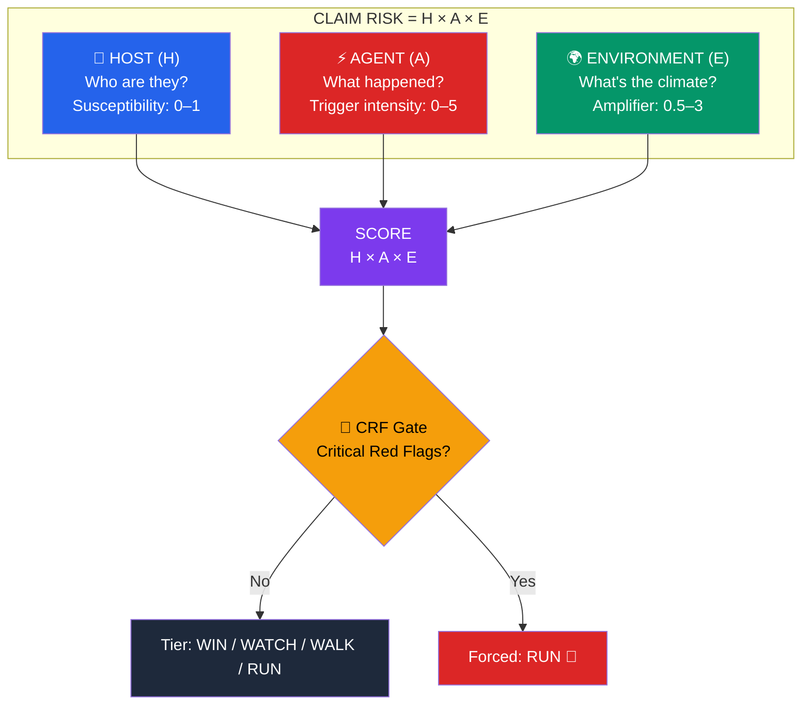
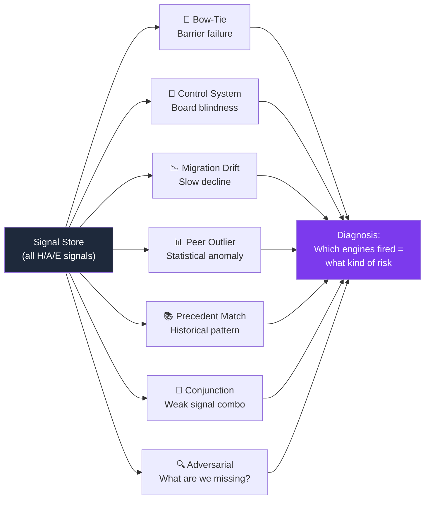

# Sasha Brain Map — Decision Support Framework

> Think of this as the "subway map" of the brain. Every decision the system makes traces back to this structure.

## The H/A/E Triangle

---

## HOST — "How sick are they?" (Inherent Susceptibility)

| Category | What It Measures | Key Signals | Source |
|----------|-----------------|-------------|--------|
| **H1: Constitutional** | Entity structure, size, complexity | Entity type, listing age, subsidiary count, countries of operation, M&A activity, SPAC status | SEC 10-K, EDGAR |
| **H2: Financial** | Balance sheet health, distress risk | Altman Z-Score, Beneish M-Score, current ratio, debt/equity, revenue trend, DSO changes, accruals | SEC 10-K/Q, XBRL |
| **H3: Governance** | Board quality, oversight structure | Board independence %, CEO/Chair duality, classified board, audit committee expertise, ISS rating, director tenure | DEF 14A, ISS |
| **H4: Management** | Leadership track record, sentiment | CEO/CFO tenure, C-suite turnover, insider ownership, insider selling patterns, Glassdoor rating, comp ratios | DEF 14A, Form 4, Glassdoor |
| **H5: Operational** | Business complexity, regulatory burden | Global footprint, regulatory bodies count, supply chain concentration, sector regulatory intensity | 10-K, sector overlay |
| **H6: Technological** | Tech debt, cybersecurity posture, IP | Data privacy exposure, legacy system reliance, R&D intensity, patent portfolio | 10-K (Item 1C), Web |
| **H7: Brand/Market** | Consumer sentiment, product reliance | Customer concentration, Net Promoter Score proxy, brand controversy history | 10-K, News, Social |

### H Scoring Logic
- Each H category scores 0–1 (low risk to high susceptibility)
- Weights: Distributed evenly across the 7 categories based on industry playbooks (e.g., Tech overweights H6; Retail overweights H7).
- Composite H = weighted average → **base rate of susceptibility**

---

## AGENT — "Did they catch something?" (Triggering Events)

| Category | What It Measures | Key Signals | Source |
|----------|-----------------|-------------|--------|
| **A1: Disclosure** | Accounting/reporting failures | Restatements, late filings, material weakness, auditor changes, going concern opinions | SEC filings, AAER |
| **A2: Market** | Market distress signals | Stock drops >10% in 5 days, short interest spikes, analyst downgrades, earnings misses, negative alpha | yfinance, market data |
| **A3: Governance** | Leadership/control disruptions | Board shakeups, activist campaigns, proxy fights, sudden C-suite departures, say-on-pay failures | DEF 14A, 8-K, news |
| **A4: Legal** | Regulatory/legal actions | SEC investigations, DOJ/AG actions, class action filings, SCAC data, derivative suits | PACER, SCAC, SEC |
| **A5: Operational** | Business disruption events | Physical disasters, product recalls, environmental incidents, safety violations, supply chain collapse | News, 8-K |
| **A6: Financial** | Financial stress events | Credit downgrades, covenant violations, dividend cuts, debt restructuring, goodwill impairments | SEC filings, Rating agencies |
| **A7: Technological**| Cyber/Data/System failures | Material cybersecurity incidents (Item 1.05), massive IT outages, IP theft | 8-K (1.05), News |
| **A8: Competitive** | Sudden market share loss | Disruptive competitor entry, loss of major "whale" client, rapid product obsolescence | 10-Q/8-K, News |

### A Scoring Logic
- Each A category scores 0–5+ (no activity to extreme trigger)
- **Primary trigger** = highest-scoring category
- **Secondary boost** = 20% of each additional active category
- Composite A = primary + secondary tail → **trigger multiplier**
- No triggers (all zeros) → A = 0 → **claim risk = 0 regardless of H or E**

---

## ENVIRONMENT — "Is it flu season?" (Amplifiers/Dampeners)

| Category | What It Measures | Key Signals | Source |
|----------|-----------------|-------------|--------|
| **E1: Litigation** | Plaintiff bar activity level | Sector lawsuit frequency, securities class action trends, average settlement size, venue risk | SCAC, Stanford SCA |
| **E2: Regulatory** | Government enforcement posture | SEC enforcement cycle, new regulations, agency focus areas, enforcement budget trends | SEC annual reports |
| **E3: Economic** | Macro headwinds/tailwinds | Interest rate cycle, recession probability, sector performance, credit conditions | Fed data, yfinance |
| **E4: Legal Landscape** | Court and statutory environment | Recent precedent-setting rulings, statutory changes, jurisdictional risk factors | Legal databases |
| **E5: Information** | Media/attention amplification | Media scrutiny level, viral risk, analyst coverage density, ESG controversy scores | News, social media |
| **E6: Geopolitical** | Global instability/supply | Tariff changes, sanctions, global supply chain shocks (e.g., shipping routing) | Macro news, Think Tanks |
| **E7: Tech Disruption**| Pace of platform shifts | AI capability jumps, rapid regulatory changes around technology, rapid obsolescence | Tech sector reports |

### E Scoring Logic
- Each E category scores 0.5–3.0 (dampens to amplifies)
- 1.0 = neutral (no effect)
- <1.0 = benign environment (dampens risk)
- \>1.0 = hostile environment (amplifies risk)
- Composite E = geometric mean → **environmental multiplier**

---

## 7 Story Engines — "What KIND of risk?"

Each engine reads the same signal store and has its own theory of how claims emerge:

| Engine | Fires When | Example |
|--------|-----------|---------|
| **Bow-Tie** | Multiple barriers weak simultaneously | Audit committee + internal controls + auditor change all flagging at once |
| **Control System** | Board isn't getting accurate info | High insider selling + no board turnover + missed earnings guidance |
| **Migration Drift** | Slow deterioration across domains | Revenue slowing + governance scores declining + litigation upticking over 6 quarters |
| **Peer Outlier** | 2+ standard deviations from peers | D/E ratio 3x sector median AND insider selling 5x peer average |
| **Precedent Match** | Profile matches historical claim pattern | "This looks like Valeant in 2015" — revenue growth via acquisition + channel stuffing signals |
| **Conjunction Scan** | 3+ weak signals combining | Moderate short interest + new auditor + CFO departure — each alone = meh, together = concerning |
| **Adversarial Critique** | Challenges the assessment | "Everything looks clean but the company is in a hot sector with zero litigation — is that suspicious?" |

---

## Tier Determination

| Tier | Score Range | Meaning | Action |
|------|-----------|---------|--------|
| **WIN** 🟢 | H×A×E < 0.3 | Want this risk | Quote competitively |
| **WATCH** 🟡 | 0.3 – 0.6 | Acceptable with conditions | Standard terms, monitor triggers |
| **WALK** 🟠 | 0.6 – 1.0 | Elevated risk | Price up, add exclusions, or decline |
| **RUN** 🔴 | > 1.0 *or* CRF veto | Avoid | Decline or refer to management |

---

## Brain Inspection — What You Can Query

| Question | Brain Answers With |
|----------|-------------------|
| "How do we assess biotech companies?" | Shows H1-H5 with biotech-specific signal overrides, FDA pipeline signals, clinical trial concentration |
| "Why did RPM get a WALK tier?" | Traces through: H2 financial = 0.7, A2 market drops = 2.1, E1 litigation = 1.4 → score = 2.06 |
| "What's our threshold for insider selling?" | Shows signal `MGMT.INSIDER.selling_ratio`, threshold = 3x peer average, current value |
| "What if I disagree with the governance score?" | Offers override → creates RDR rule: "unless [your condition], H3 should be [your value]" |
| "What signals are we NOT checking?" | Shows gaps: data points defined in brain but with no collection source yet |
